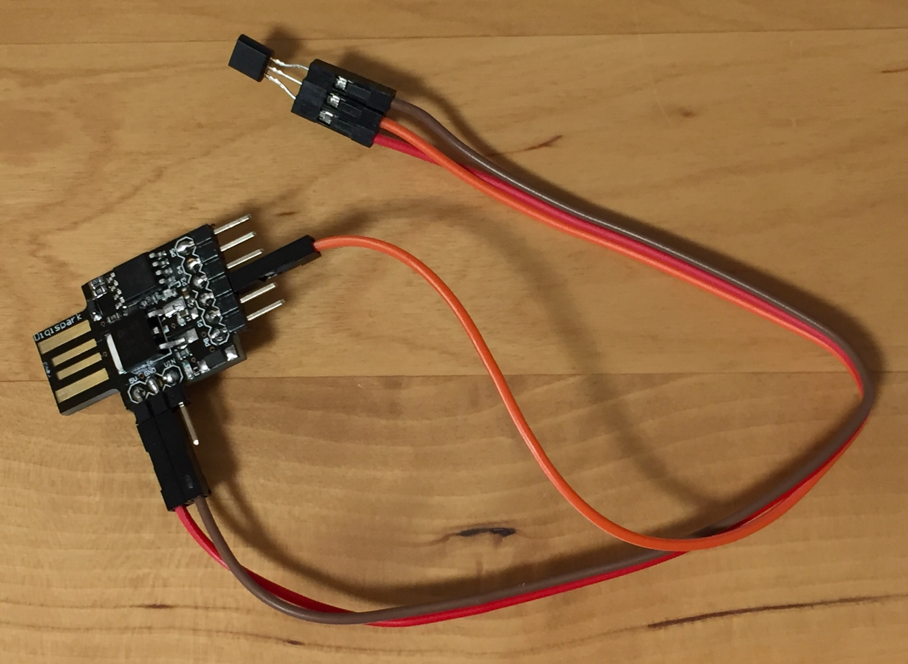

# Digispark LM61CIZ temperature for ROS

Arduino:

upload `arduino/arduino.ino`



Launch:

```
$ cd catkin_ws/src
$ git clone https://github.com/atotto/digi_temper.git --depth 1
$ roslaunch digi_temper digi_temper.launch
```


